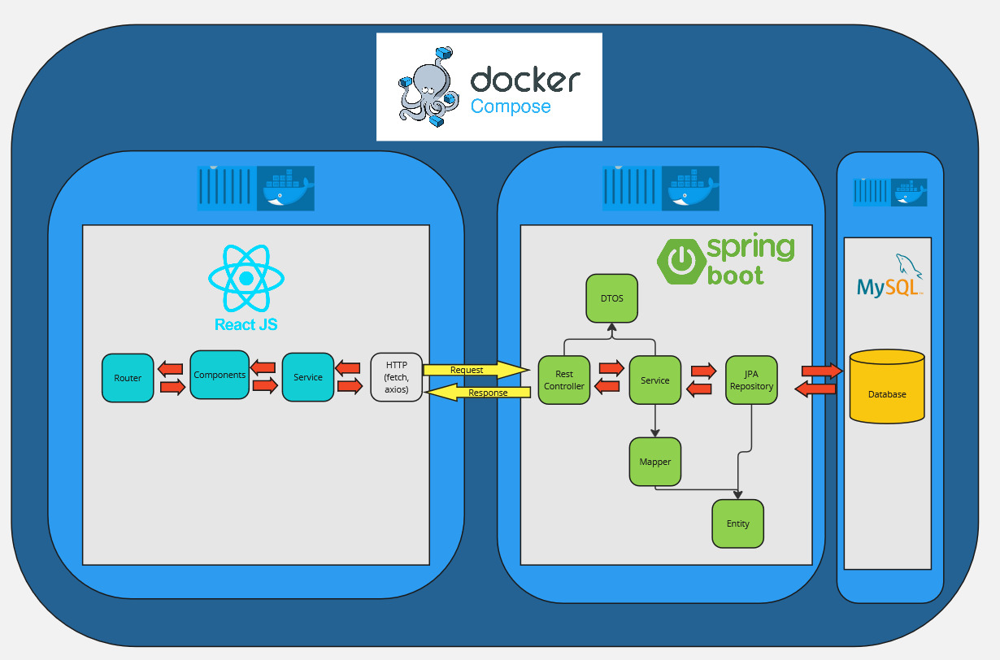

# **Projekt-Dokumentation**

## **Software-Architektur**
Hier ist eine Übersicht der Architektur der Anwendung:

---

## **Demo-Video**
Hier ist ein kurzes Demo-Video zur Anwendung:

---

## **Frontend**

### **LoginForm.js**
Die **`LoginForm`**-Komponente erhält verschiedene Eigenschaften wie:  
**`login`**, **`password`**, **`onChange`**, **`onSubmit`**, **`emailError`**, **`loginError`** und **`switchToRegister`**.  
Diese Eigenschaften helfen dabei, das Formular zu steuern und Fehler anzuzeigen.  
Im Formular gibt es zwei Eingabefelder für E-Mail und Passwort sowie zwei Buttons:  
einen zum Anmelden und einen zum Wechseln zur Registrierungsseite.  
Fehlermeldungen werden angezeigt, wenn es welche gibt.  
Das Styling wird mit **Tailwind CSS** gemacht, und die Komponente verwendet **`PropTypes`**, um sicherzustellen, dass die richtigen Daten übergeben werden.  
Am Ende wird die **`LoginForm`**-Komponente exportiert, damit sie in anderen Teilen der Anwendung genutzt werden kann.

---

### **LoginPage.js**
Das „**LoginPage.js**“-File ist für das Hin- und Herschalten von Login und Register zuständig.  
Außerdem trägt es die Aufgabe, die Benutzereingabe mit Hilfe von **Ajv** zu validieren und die eingegebenen Werte weiterzuleiten.

---

### **RegisterForm.js**
Der Code definiert eine React-Komponente **`RegisterForm`**, die ein Registrierungsformular erstellt.  
Die Gestaltung erfolgt mit **Tailwind CSS** für ein konsistentes Design.  
Die Komponente nutzt Eigenschaften wie **`firstName`**, **`lastName`**, **`login`**, **`password`**, **`onChange`**, **`onSubmit`**, **`emailError`** und **`switchToLogin`**,  
um das Formular zu steuern, Eingaben zu verwalten und Fehler anzuzeigen.  
Das Formular enthält Eingabefelder für Vorname, Nachname, E-Mail und Passwort sowie zwei Buttons:  
einen zur Registrierung und einen zum Wechsel zur Login-Seite.

---

### **BackButton.js**
Das „**BackButton.js**“-File ist für die Navigation und auch für das Ausloggen zuständig.  
Je nachdem, welche Komponente momentan angezeigt wird, erscheint entweder das Icon „**CircleArrowLeft**“,  
um zur vorherigen Ansicht zu gelangen, oder das Icon „**LogOut**“, um sich abzumelden.

---

### **HistoryButton.js**
Die Aufgabe des **History Button** ist es, die vom Benutzer zuletzt geänderten/erstellten Datensätze anzuzeigen.  
Im Code wird die beim Login eingegebene E-Mail **encoded** und anschließend bei der URL eingesetzt.  
Um Zugriff auf die Daten zu bekommen, wird ein **Authentifizierungstoken** benötigt,  
welcher aus dem **Local Storage** geholt und im Header der **Get-Anfrage** mitgegeben wird.  
Die gefundenen Datensätze werden in der Variable **historyData** im JSON-Format abgespeichert.

---

### **Modal.js**
Das „**Modal.js**“-File wird verwendet, um die Daten, die beim Betätigen des **History-Knopfs** abgerufen werden,  
zu skalieren und in einem Pop-up anzuzeigen. Der **Modal** enthält zwei integrierte Funktionen: Zum einen die „**hData**“-Funktion,  
die die Daten abruft, und zum anderen die „**onClose**“-Funktion, um das Pop-up zu schließen.

---

### **WelcomePage.js**
Die **`WelcomePage`**-Komponente zeigt eine Begrüßungsnachricht an und verwendet den **`useEffect`**-Hook,  
um eine Funktion **`onAnimationEnd`** nach **1200 Millisekunden** aufzurufen, sofern sie vorhanden ist.  
Der Timer wird bei der Demontage der Komponente gelöscht, um Speicherlaggs zu vermeiden.  
Die Komponente zeigt den Text „**LIEBHERR**“ in der Mitte des Bildschirms an, wobei eine **CSS-Animation** (**`slide-in-top`**) angewendet wird.

---

### **DataInputForm.js**
Die **`InputDataForm`**-Komponente stellt ein Formular zur Eingabe und Anzeige von Projektdaten bereit.  
Zunächst werden das Profilbild und der Name der angemeldeten Person angezeigt.  
Die Komponente enthält ein Eingabefeld für die Projektnummer und eine Auswahlkomponente (**`NumberToSelect`**) für die Version,  
die durch entsprechende Handler-Funktionen aktualisiert werden.

---

### **DataInputPage.js**
Die Datei „**InputDataPage.js**“ ist dafür zuständig, Benutzereingaben zu erfassen und damit Maschinendaten abzurufen.  
Diese Komponente verwaltet den aktuellen Zustand der Anwendung,  
sendet „**Get**“-Anfragen basierend auf den Eingaben und übergibt die erhaltenen Daten an andere Teile der Anwendung.  
Außerdem integriert sie Funktionen wie **Scanner-Unterstützung** und **Versionsverwaltung**, um die Datenerfassung einfach und effizient zu gestalten.

---

### **DataSelectPage.js**
Diese React-Komponente namens „**DataSelectPage.js**“ zeigt eine Liste von Maschinendaten an,  
aus denen der Benutzer ein Element auswählen und abschicken kann. Sie verarbeitet die Daten,  
indem es die relevanten Informationen extrahiert und diese in einer Tabelle zur Auswahl anzeigt.  
Der Benutzer kann ein Element durch Anklicken eines Kästchens auswählen, und wenn die Auswahl getroffen wurde,  
kann er diese durch Klicken auf den „**Submit**“-Button bestätigen.

---

### **DataSelectTable.js**
Die **DataSelectTable**-Komponente zeigt eine Tabelle zur Auswahl von Daten an. Sie verwendet die **relevantData**-Eigenschaft,  
um die Tabelle mit Daten zu füllen. Die Tabelle hat Spalten für „**Auswahl**“, „**Element**“, „**Version**“ und „**Seriennummer**“.  
Jede Zeile enthält eine Checkbox, die markiert wird, wenn die **ID** des Elements mit der **selectedId** übereinstimmt.  
Änderungen an der Checkbox lösen die Funktion **handleCheckboxChange** aus, um die Auswahl zu aktualisieren.  
Das Layout und Styling der Tabelle erfolgen durch **Tailwind CSS**.

---

### **NumberToSelect.js**
Die **`NumberToSelect`**-Komponente erstellt ein **Dropdown-Menü**, das Zahlen von 1 bis zu einer angegebenen maximalen Version (**`maxVersion`**) anzeigt,  
sowie die nächste höhere Version als "**NEU**". Sie verwendet **React Hooks**, um die Optionen dynamisch basierend auf der **`maxVersion`** zu generieren und stellt sicher,  
dass der ausgewählte Wert korrekt aktualisiert wird. Wenn kein gültiger Wert vorliegt, wird standardmäßig die maximale Version ausgewählt.

---

### **SerialNumberForm.js**
Die **`SerialNumberForm`**-Komponente zeigt ein Formular, das es ermöglicht, eine **Seriennummer** einzugeben oder zu scannen.  
Die Komponente zeigt den aktuell angemeldeten Benutzer oder die Benutzerin, ein Eingabefeld für die Seriennummer und Informationen zum ausgewählten Artikel.  
Wenn der **QR-Scanner** sichtbar ist, wird dieser angezeigt, andernfalls wird ein Eingabefeld für die Seriennummer und ein Button zum Öffnen des Scanners bereitgestellt.  
Nach der Eingabe oder Auswahl kann das Formular über den "**Submit**"-Button abgeschickt werden.

---

### **SerialNumberPage.js**
Die **SerialNumberPage**-Komponente ermöglicht das Eingeben oder Scannen einer **Seriennummer** und das Senden der Daten mit einem "**post**".  
Falls eine Seriennummer im **sessionStorage** gespeichert ist, wird sie automatisch geladen.  
Je nach Erfolg wird eine **Bestätigung** oder eine **Fehlermeldung** angezeigt.

---

### **UseScannerSetupAndConvertingTable**
Der Code verarbeitet die Ergebnisse des Scanners, um die **Projekt-ID** und die **Seriennummer** aus dem gescannten Text zu extrahieren.  
Zunächst wird das Ergebnis des Scans (**`result`**) ausgewertet. Der Text wird anhand verschiedener Trennzeichen wie „**|**“, „**_**“ und „**;**“ in Teile aufgeteilt,  
um die relevanten Informationen zu filtern.  
Zuerst wird versucht, den Text mit dem Trennzeichen „**|**“ zu splitten. Wenn der Text erfolgreich in mehrere Teile zerlegt wird,  
werden die ersten beiden Teile als **Projekt-ID** und **Seriennummer** identifiziert und gespeichert.  
Falls die Aufteilung mit „**|**“ nicht funktioniert, wird der Text alternativ mit den Trennzeichen „**_**“ und anschließend „**;**“ aufgeteilt.  
Bei erfolgreicher Aufteilung werden wiederum die entsprechenden Teile als **Projekt-ID** und **Seriennummer** zugewiesen.

---

### **ajv.js**
Im **Ajv.js**-File sind die verschiedenen Schemen mit Kriterien definiert, die beim **Login** und **Registrieren** erfüllt werden müssen, wie **Mindestlänge** usw.

---

### **axios_helper.js**
Dieses File stellt sicher, dass alle Anfragen an das **Backend** korrekt und sicher durchgeführt werden.

---

### **app.js**
**App.js** Die Datei "**App.js**" ist die zentrale Einstiegsdatei der Anwendung und steuert die Darstellung der Hauptkomponenten.  
Sie verwaltet den Zustand der aktuellen Ansicht und regelt die **Navigation** zwischen verschiedenen Seiten wie **Login**, **Dateneingabe** und **Maschinendatenanzeige**.

---

## **Backend**
Das Backend des Projekts wurde in verschiedenen Paketen unterteilt,  
um eine klare Trennung der Verantwortlichkeiten und der Struktur zu gewährleisten.

---

### **API Dokumentation**
- **http://localhost:8080/v3/api-docs**  
- **Swagger-UI**: [http://localhost:8080/swagger-ui/index.html](http://localhost:8080/swagger-ui/index.html)  
    - Falls die Dokumentation nicht geladen wird, gebe **`/v3/api-docs`** im Suchfeld ein.

---

### **config**
Das „**config**“-Paket enthält die Konfigurationsklassen der Anwendung,  
die sowohl für die **Sicherheit** als auch für andere zentrale Konfigurationen verantwortlich sind.

---

### **JwtAuthFilter**
Diese Klasse ist für die **JWT-basierte Authentifizierung** zuständig.  
Sie überprüft bei jeder Anfrage, ob ein gültiger JWT im **Authorization-Header** vorhanden ist.  
Falls das Token gültig ist, wird die **Authentifizierung** gespeichert,  
andernfalls wird die Anfrage als nicht authentifiziert abgelehnt.

---

### **PasswordConfig**
Diese Klasse wurde erstellt, um **Passwörter zu hashen**, bevor sie in der Datenbank gespeichert werden.

---

### **SecurityConfig**
Die **Sicherheitsrichtlinien** der Anwendung werden in dieser Klasse konfiguriert.  
Hier werden die **Endpunkte** definiert, die öffentlich zugänglich sind, und jene die eine **Authentifizierung** erfordern.  
Um sicherzustellen, dass **JWTs** bei jeder Anfrage überprüft werden, wird hier der **JWTAuthFilter** in die Sicherheitskette eingebunden.

---

### **UserAuthenticationEntryPoint**
Diese Klasse definiert, wie nicht authentifizierte Anfragen behandelt werden.  
Wenn eine nicht authentifizierte Anfrage auf einen geschützten Endpunkt zugreift,  
wird eine Fehlermeldung mit dem **Statuscode 401** zurückgegeben.

---

### **UserAuthticationProvider**
Diese Klasse ist verantwortlich für die Erstellung und Validierung von **JWTs**.  
Sie verwendet einen geheimen Schlüssel, um JWTs zu signieren und zu überprüfen.  
Bei erfolgreicher Validierung wird die **Authentifizierung** des Nutzers gespeichert.

---

### **WebConfig**
Diese Klasse konfiguriert die **CORS-Richtlinien** der Anwendung, um sicherzustellen,  
dass das **Frontend** sicher auf das **Backend** zugreifen kann.  
Sie erlaubt spezifische HTTP-Methoden und Header für Anfragen von bestimmten Ursprüngen.

---

### **Ablauf der Authentifizierung beim Login**
1. **Anfrage vom Client**:  
   - Der Client sendet eine **POST-Anfrage** an **/login** mit den **Anmeldedaten**  
2. **WebConfig (CORS-Filter)**:  
   - Prüft die **IP-Adresse** der Anfrage und deren **Herkunft**  
3. **SecurityConfig (SecurityFilterChain)**:  
   - Prüft, ob der **Endpunkt zugänglich** ist  
   - Gibt ggf. eine **403- oder 401-Fehlermeldung** zurück  
4. **Authentifizierung durch den AuthController**:  
   - Überprüft die **Anmeldedaten**  
   - Falls inkorrekt, wird die Anfrage **abgelehnt**  
5. **JWT-Erstellung**:  
   - Bei Erfolg wird ein **JWT-Token** generiert  
6. **JWT an den Client senden**:  
   - Der Client kann dieses Token für **zukünftige Anfragen** verwenden  

---

## Informationen
Vielleicht fragen Sie sich, warum zwei identische Tabellen benötigt werden.
Die Antwort ist einfach: Es handelt sich um eine Anforderung unserer Partnerfirma.
Wir sind bewusst, dass es eine elegantere Lösung geben könnte. Bei weiteren Fragen können
Sie sich gerne jederzeit bei uns melden. 